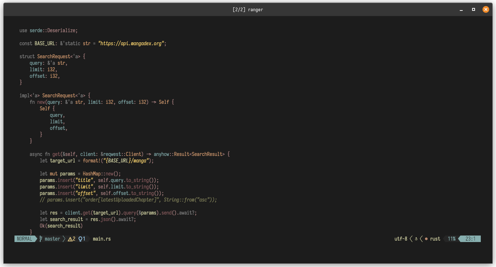

<!-- <div align="center"> -->
<!--       <h1> <br/>gruvbox.nvim</h1> -->
<!--      </div> -->

A port of [alduin](https://github.com/AlessandroYorba/alduin) theme to lua with [treesitter](https://github.com/nvim-treesitter/nvim-treesitter) and [semantic highlights](https://neovim.io/doc/user/lsp.html#lsp-semantic-highlight) support!

<p align="center">
    
</p>

# Prerequisites

Neovim 0.8.0+

# Installing

## Using `packer`

```lua
use { "bakageddy/alduin.nvim" }
```

## Using `lazy.nvim`

```lua
{ "bakageddy/alduin.nvim", priority = 1000 , config = true, opts = ...}
```

## Using `vim-plug`

```vim
Plug 'bakageddy/alduin.nvim'
```

# Basic Usage

Inside `init.vim`

```vim
colorscheme alduin
```

Inside `init.lua`

```lua
vim.cmd([[colorscheme alduin]])
```

# Configuration

Additional settings for gruvbox are:

```lua
-- Default options:
require("alduin").setup({
  terminal_colors = true, -- add neovim terminal colors
  inverse = true, -- invert background for search, diffs, statuslines and errors
  palette_overrides = {},
  overrides = {},
})
vim.cmd("colorscheme alduin")
```

**VERY IMPORTANT**: Make sure to call setup() **BEFORE** calling the colorscheme command, to use your custom configs
